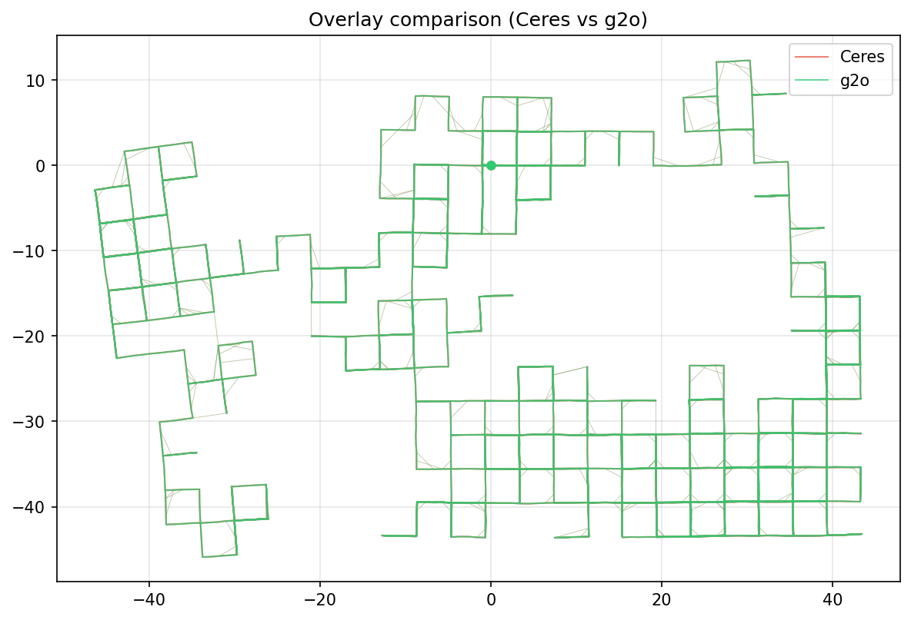

# ceres_vs_g2o

Hands-on comparison of Ceres Solver and g2o for 2D pose graph optimization — the core problem behind graph-based SLAM. Benchmarks convergence, timing, and final cost on the Manhattan3500 dataset.

## Problem Statement

In graph-based SLAM a robot accumulates a set of **poses**
$`\mathbf{x}_i = (x_i,\, y_i,\, \theta_i)^T`$ and **relative measurements**
$`\tilde{\mathbf{z}}_{ij}`$ between pose pairs (from odometry and loop closures).
The goal is to find the pose set $`\mathcal{X}`$ that best explains all constraints:

```math
\mathcal{X}^* = \arg\min_{\mathcal{X}} \sum_{(i,j) \in \mathcal{E}}
    \mathbf{e}_{ij}^T \; \Omega_{ij} \; \mathbf{e}_{ij}
```

where $`\Omega_{ij}`$ is the $`3\times3`$ information matrix (inverse covariance) and
the residual compares the measured relative pose against the one predicted by the
current estimates:

```math
\mathbf{e}_{ij} = \tilde{\mathbf{z}}_{ij} - \hat{\mathbf{z}}_{ij}, \qquad
\hat{\mathbf{z}}_{ij} = \begin{pmatrix}
    R_i^T (\mathbf{t}_j - \mathbf{t}_i) \\
    \theta_j - \theta_i
\end{pmatrix}
```

The angle component of $`\mathbf{e}_{ij}`$ is normalised to $`(-\pi, \pi]`$.
Pose 0 is held fixed to remove the gauge freedom.

Dataset: **Manhattan 3500** — 3 500 nodes, 5 598 edges.

## Solver Architecture

### Ceres (`src/ceres_solver.cpp`)

```text
PoseGraphCostFunctor
  ├── Constructor  — pre-computes L = chol(Ω)  (Cholesky factor of the information matrix)
  ├── operator()   — templated on T (double or Jet for AutoDiff)
  │     1. compute z_hat from pose_i, pose_j  (rotate translation difference into frame i)
  │     2. raw error e = z_tilde - z_hat       (angle component normalised via atan2)
  │     3. whiten:  r = L * e                  (maps to unit-covariance residual)
  └── Create()     — returns AutoDiffCostFunction<3 residuals, 3+3 params>

solveCeres()
  ├── copies poses into flat double[3] arrays  (contiguous memory for Ceres)
  ├── adds one residual block per edge
  ├── fixes param block 0 (anchor)
  └── runs SPARSE_NORMAL_CHOLESKY solver, writes results back
```

Key choice: **AutoDiffCostFunction** — Ceres differentiates `operator()` via dual
numbers (Jets), so no analytic Jacobians are needed.

### g2o (`src/g2o_solver.cpp`)

```text
VertexPose2D  : BaseVertex<3, Pose2D>
  ├── setToOriginImpl()  — reset estimate to zero pose
  └── oplusImpl(Δ)       — additive update with angle normalisation

EdgePose2D  : BaseBinaryEdge<3, Pose2D, VertexPose2D, VertexPose2D>
  └── computeError()     — _error = z_tilde - z_hat
                           (g2o applies _information internally for chi2 / gradient)

solveG2O()
  ├── solver chain:  LinearSolverEigen → BlockSolverPL<3,3> → GaussNewton
  ├── adds one VertexPose2D per pose (vertex 0 fixed)
  ├── adds one EdgePose2D per constraint
  └── runs optimizer.optimize(max_iter), writes results back
```

Key difference from Ceres: g2o applies the information matrix itself when
accumulating the system — `computeError()` returns the raw (un-whitened) residual.

## Results

Manhattan3500 dataset — 3 500 nodes, 5 453 edges.

| Metric | Ceres | g2o |
| --- | --- | --- |
| Initial cost | 1 283 333.83 | 1 283 333.83 |
| Final cost | 68.96 | 68.96 |
| Iterations | 26 | 100 |
| Time (ms) | 157.4 | 485.5 |
| Converged | yes | yes |

Both solvers reach the same minimum. Ceres converges ~3× faster with far fewer iterations, thanks to AutoDiff Jacobians feeding a tighter Gauss-Newton step. g2o uses numerical differentiation by default, requiring more iterations to reach the same precision.



## Quick Start

```bash
# Install dependencies (Ubuntu 22.04)
sudo apt install libceres-dev libg2o-dev libeigen3-dev python3-matplotlib

# Download dataset
bash scripts/download_data.sh

# Build
mkdir build && cd build
cmake .. -DCMAKE_BUILD_TYPE=Release
make -j$(nproc)
cd ..

# Run
./build/slam_opt_compare --dataset data/manhattan3500.g2o

# Visualise
python3 scripts/plot_result.py
```

## Project Structure

```text
├── include/
│   ├── pose_graph.hpp      # Pose2D, Edge2D, PoseGraph, SolverResult
│   ├── ceres_solver.hpp    # solveCeres() declaration
│   └── g2o_solver.hpp      # solveG2O() declaration
├── src/
│   ├── main.cpp            # CLI entry point
│   ├── pose_graph.cpp      # .g2o loader, SE(2) math, cost computation
│   ├── ceres_solver.cpp    # PoseGraphCostFunctor + solveCeres()
│   └── g2o_solver.cpp      # VertexPose2D, EdgePose2D, solveG2O()
├── data/                   # datasets (downloaded separately)
├── scripts/
│   ├── download_data.sh
│   └── plot_result.py
└── results/                # solver output files
```

## Dependencies

| Library | Purpose |
| ------- | ------- |
| [Eigen3](https://eigen.tuxfamily.org/) | Matrix math |
| [Ceres Solver](http://ceres-solver.org/) | Non-linear LS backend 1 |
| [g2o](https://github.com/RainerKuemmerle/g2o) | Non-linear LS backend 2 |

## License

MIT
